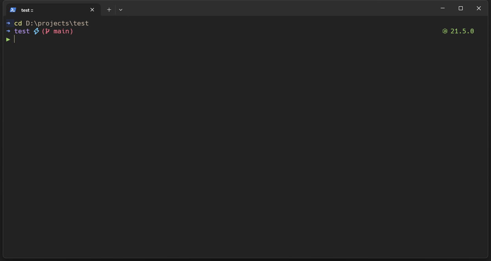

#  Windows-Configs
Configuration files for windows PowerShell

<p align="center">
	
</p>

## Usage

1. Install oh-my-posh

```
winget install JanDeDobbeleer.OhMyPosh -s winget
```

2. Double-click to open the `HackNerdFont-Regular.ttf` file, then click to install Hack Nerd Font

3. Copy `.config` folder to `C:\Users\<USER_NAME>\`

4. Run `notepad $PROFILE`, when the above command gives an error, you should run `New-Item -Path $PROFILE -Type File -Force` to create the profile first

5. Copy the content of Microsoft.PowerShell_profile.ps1, save it, and replace `<USER_NAME>` with your username , then run `. $PROFILE` 

6. In PowerShell, press `Shift + Ctrl + ,` to open `setting.json`. Copy the content from the repository's setting.json and save it. Then, return to PowerShell, press `Ctrl + .` to open settings, choose 'color schemes' and select 'red planet' as the default