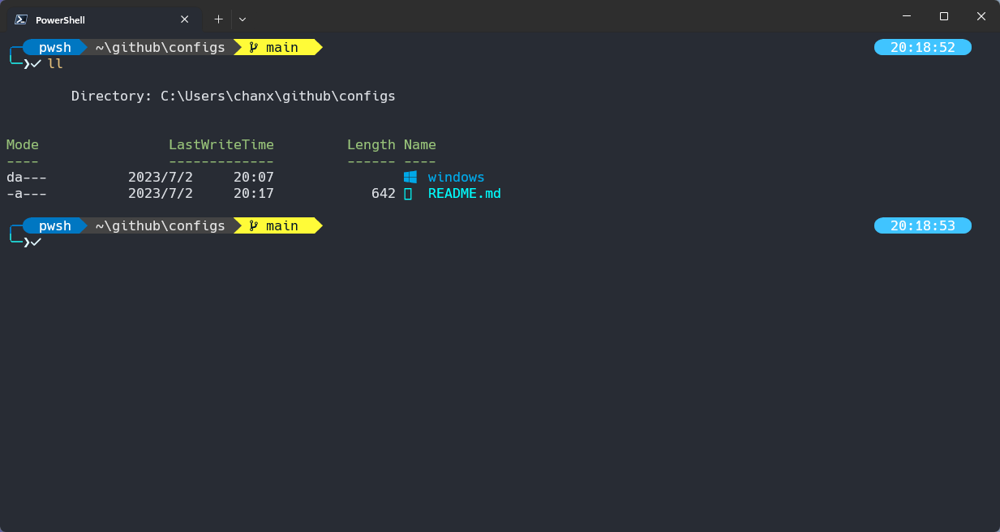

# Windows configs
Configuration files used when setting up the computer

**Warning**: Before copying the configuration file, you need to install the required plug-ins below, and you can delete the content in the configuration file according to your needs.

## Contents

- [PowerShell setup (Windows)](#PowerShell)

### PowerShell setup (Windows)

- [Scoop](https://scoop.sh/) - A command-line installer
- [Git for Windows](https://gitforwindows.org/)
- [Oh My Posh](https://ohmyposh.dev/) - Prompt theme engine
- [Terminal Icons](https://github.com/devblackops/Terminal-Icons) - Folder and file icons
